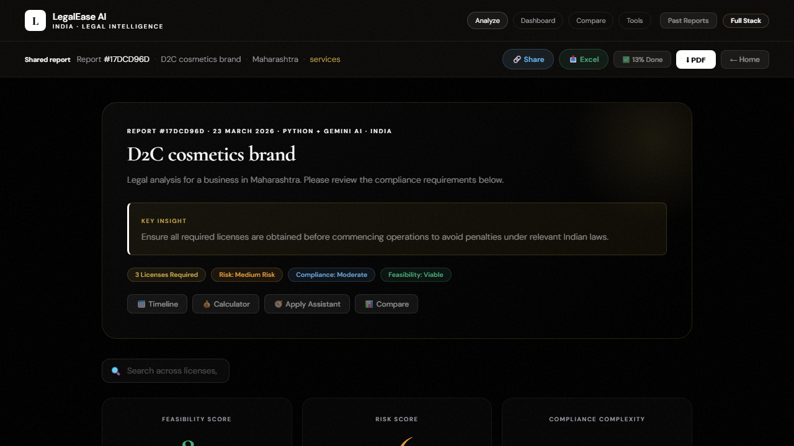

# LegalEase AI


AI-powered legal intelligence platform for Indian founders.  
LegalEase turns a business idea into a structured compliance report with licenses, risks, action steps, document verification, downloadable reports, and founder-friendly workspace tools.

## Feature Grid

| Feature | What it gives you |
|------|------|
| Business Analysis | Converts a founder idea into a structured compliance report |
| Legal Dashboard | Shows feasibility, risk, complexity, and required licenses clearly |
| Document Vault | Uploads and verifies compliance documents with custom verification notes |
| Workspace Tools | Tracks tasks, action steps, comparisons, and operational follow-through |
| Report Exports | Generates founder-ready PDF and premium Excel reports |

## Screenshots

### Analyze Flow


### Report Dashboard


## What It Does

- Analyzes a startup or business idea with India-specific compliance logic
- Generates a full legal/compliance report with risks, licenses, costs, and actions
- Stores past reports for dashboard access and comparison
- Lets users upload and verify required documents in a document vault
- Exports polished PDF and Excel reports

## Stack

- Frontend: React + Vite
- Backend: FastAPI + Python
- Database: SQLite
- AI: Gemini for report enrichment, Groq for document verification
- Reports: ReportLab PDF + OpenPyXL Excel

## Run Locally

### Backend

```bash
cd backend
python -m venv .venv_clean
.venv_clean\Scripts\activate
pip install -r requirements.txt
uvicorn main:app --reload --host 127.0.0.1 --port 8000
```

### Frontend

```bash
cd frontend
npm install
npm run dev
```

App URLs:

- Frontend: `http://127.0.0.1:5173`
- Backend: `http://127.0.0.1:8000`
- API Docs: `http://127.0.0.1:8000/docs`

## Deployment

### Backend

Deploy the FastAPI app to Railway, Render, or any Python host.

Required backend environment variables:

```env
GEMINI_API_KEY=your_gemini_key
GROQ_API_KEY=your_groq_key
BASE_URL=https://your-backend-url
FRONTEND_URL=https://your-frontend-url
CORS_ORIGINS=https://your-frontend-url
DB_PATH=/var/data/legalease.db
GENERATED_REPORTS_DIR=/var/data/generated_reports
DOCUMENT_UPLOADS_DIR=/var/data/uploaded_documents
```

If you deploy on Render with SQLite and file uploads enabled, use a persistent disk. The included `render.yaml` is configured for that.

### Frontend

Deploy the Vite frontend to Vercel or Netlify.

Required frontend environment variable:

```env
VITE_API_BASE=https://your-backend-url
```

## Key Features

- Business analysis dashboard
- Past reports and report comparison
- Compliance timeline and apply assistant
- Workspace task tracker
- Document vault with verification notes
- PDF and premium Excel export

## Disclaimer

LegalEase AI is an informational product and not a substitute for advice from a qualified lawyer, CA, or compliance professional.
